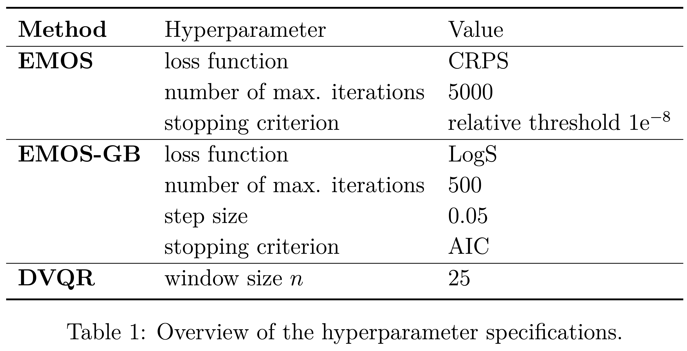

# D-Vine GAM Copula based Quantile Regression with Application to Ensemble Postprocessing

This repository provides supplementary material for the following paper:

> Jobst, D., Möller, A., and Groß, J., 2023. D-Vine GAM Copula based
> Quantile Regression with Application to Ensemble Postprocessing. doi:
> [10.48550/arXiv.2309.05603](https://arxiv.org/abs/2309.05603).

## Data

The data needed for reproducing the results is publicly available:

> Jobst, David, Möller, Annette, & Groß, Jürgen. (2023). Data set for
> the ensemble postprocessing of 2m surface temperature forecasts in
> Germany for 24 hours lead time (0.1.0) \[Data set\]. Zenodo.
> <https://doi.org/10.5281/zenodo.8127734>

For the data license see
[here](https://github.com/jobstdavid/paper_gamvinereg/blob/main/DATA_LICENSE).

### ECMWF forecasts

-   Source: [ECMWF](https://www.ecmwf.int) (European Centre for
    Medium-Range Weather Forecasts)
-   Gridded forecasts: 50-member ensemble forecasts
-   Time range: 2015-01-02 to 2020-12-31
-   Forecast leadtime: 24 hours
-   Forecast initialization time: 12 UTC
-   Area: Germany
-   Resolution: 0.25 degrees
-   Meteorological variables

| Variable | Description                                                                                         |
|----------|-----------------------------------------------------------------------------------------------------|
| t2m      | [2m surface temperature](https://codes.ecmwf.int/grib/param-db/?id=167)                             |
| d2m      | [2m surface dewpoint temperature](https://codes.ecmwf.int/grib/param-db/?id=168)                    |
| p        | [Surface pressure](https://codes.ecmwf.int/grib/param-db/?id=134)                                   |
| sr       | [Surface solar radiation](https://codes.ecmwf.int/grib/param-db/?id=176)                            |
| u10m     | [10m surface u-wind speed component](https://codes.ecmwf.int/grib/param-db/?id=165)                 |
| v10m     | [10m surface v-wind speed component](https://codes.ecmwf.int/grib/param-db/?id=166)                 |
| r2m      | [2m surface relative humidity](https://doi.org/10.1175/1520-0450(1996)035%3C0601:IMFAOS%3E2.0.CO;2) |
| tcc      | [Total cloud cover](https://codes.ecmwf.int/grib/param-db/?id=164)                                  |
| ws10m    | [10m surface wind speed](https://confluence.ecmwf.int/pages/viewpage.action?pageId=133262398)       |
| wg10m    | [10m surface wind gust](https://codes.ecmwf.int/grib/param-db/?id=49)                               |

### DWD observations

-   Source: [DWD Climate Data
    Center](https://opendata.dwd.de/climate_environment/CDC/observations_germany/climate/hourly/air_temperature/historical/BESCHREIBUNG_obsgermany_climate_hourly_tu_historical_de.pdf)
    ([German Weather Service](https://www.dwd.de))
-   Observation data: Hourly observations of the target variable (2m
    surface temperature)
-   Number of stations: 462
-   ECMWF forecasts: Bilinearly interpolated to the SYNOP stations and
    reduced to its mean (variable\_mean) and standard deviation
    (variable\_sd)
-   Metadata

| Variable | Description                           |
|----------|---------------------------------------|
| obs      | Observation of 2m surface temperature |
| id       | Station ID                            |
| name     | Station name                          |
| lon      | Longitude of station                  |
| lat      | Latitude of station                   |
| elev     | Elevation of station                  |
| date     | Date                                  |
| doy      | Day of the year                       |
| sin1     | Sine-transformed day of the year      |
| cos1     | Cosine-transformed day of the year    |

## Ensemble postprocessing

All models except of the D-vine copula quantile regression (DVQR) are
estimated based on the static training data 2015-2019. For the DVQR
model estimation a day-by-day sliding training window is applied which
uses training data of 2020 as well. Finally, all models are evaluated in
the whole year 2020.

### R-packages for the ensemble postprocessing models

-   [crch](https://cran.r-project.org/web/packages/crch/index.html):
    Local Ensemble Model Output Statistics (EMOS) and its
    gradient-boosted extension (EMOS-GB)
-   [vinereg](https://cran.r-project.org/web/packages/vinereg/index.html):
    Local D-vine copula based quantile regression (DVQR)
-   [gamvinereg](https://github.com/jobstdavid/gamvinereg): Local D-vine
    GAM copula based quantile regression (GAM-DVQR)

### Additional R-packages

-   [eppverification](https://github.com/jobstdavid/eppverification):
    For the verification of the ensemble postprocessing models

## Implementation details

### Hyperparameter specifications

### Marginal distributions for GAM-DVQR

> Smithson, M. and Verkuilen, J. (2006). A better lemon squeezer?
> Maximum-likelihood regression with beta-distributed dependent
> variables. In: *Psychological Methods* 11.1, pp. 54–71. doi:
> [10.1037/1082-989x.11.1.54](http://doi.org/10.1037/1082-989x.11.1.54).
